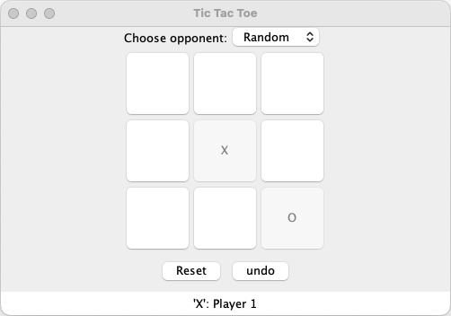

# Tic-Tac-Toe game
This repository implements a Tic-tac-toe game using Java. 
It applies the MVC model architecture, the template method design pattern, and the composite design patterns.
Apache Ant, the Javax package, and the JUnit package are used. 

  

## 1. Functionalities

### TicTacToe game

Each player plays alternatively and puts "O" or "X" in the 3 x 3 block.
Player 1 always puts "X" and Player 2 always puts "O".
The first player who sets three consecutive "O" or three "X" horizontally, vertically, or in diagonal wins.

### Undo functionality
Players can undo their previous moves.

### Reset functionality

The game can be reset by clicking a button

### Opponents
1. Human
2. A random agent

## 2. How to use

### How to build and test (from Terminal):

1. Make sure Apache Ant is installed.

2. Run `ant document` to generate the javadoc (a hypertext description) for all of the java classes. Generated hypertext description will be in the `jdoc` folder. Open the `index.html` file. 

3. Run `ant compile` to compile all of the java classes. Compiled classes will be in the `bin` folder.

4. Run `ant test` to run all unit tests.

### How to run (from Terminal):

1. After building the project (i.e., running `ant`), run the following command in the tictactoe folder:
   `java -cp bin RowGameApp`

### How to clean up (from Terminal):

1. Run `ant clean` to clean the project (i.e., delete all generated files).

## 3. Test cases

### TestFinalResult.java
- testPlayer1Wins: Player 1 wins correctly
- testPlayer2Wins: Player 2 wins correctly
- testUpdateTie: The game ties correctly

### TestGameReset.java
- testReset: The game resets correctly

### TestIllegalMove.java
- testIllegalMove: An illegal move are ignored

### TestLegalMove.java
- testLegalMove: A legal move is handled correctly

### TestUndo.java
- testUndo: Using the undo functionality is handled correctly

### TestUndoNotPermitted.java
- testUndoNotPermitted: The undo functionality is disabled when there are no previous moves
